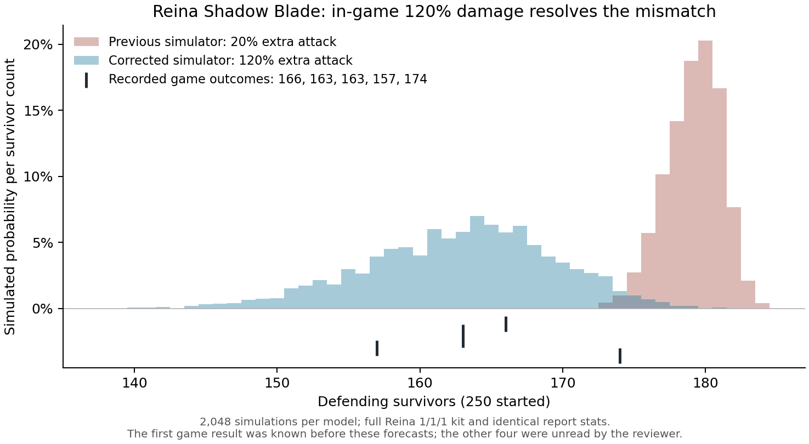

# Reina extra-attack magnitude

The first new full-kit Reina1/1/1 battle left166 defenders, all66 Infantry plus50 Lancers and50 Marksmen. Exact report stats were verified: WIP Lancer Attack/Defense326.2/325.0, Lethality/Health186.8/181.9. The current20% S3 model predicts179.17 defenders and puts all2,048 sampled outcomes between173 and184. Its unchanged-target interpretation preserves both backlines, as observed, but its damage contribution is too small.

Three named interpretations were recorded in `protocol.json` before running the diagnostic: the configured20% attack, a whole extra attack at100%, and an extra attack with its100% base plus20%, totaling120%. These are semantic alternatives, not a fitted coefficient grid. Only the level-1 S3 coefficient differs; full kit, stats, proc rates, damage kind, targets and fractional/source-count arithmetic stay fixed. The archived probe engine is used.

| S3 damage basis | Defender mean / per-battle SD | Central95% range | Mean raw S3 kills,256 traces |
|---|---|---|---|
| Current20% |179.17 /1.97|175–182|3.07|
| Whole100% |166.17 /5.52|155–176|15.45|
| Base plus20%=120% |162.89 /6.53|149–175|18.57|

Both stronger alternatives make the first outcome plausible; that observation alone does not choose between them. Raw skill damage is not equated to the game's displayed attributed kills. All2,048 samples per model retain living Infantry and unchanged backlines. `results.json` preserves every sampled endpoint and256 traces per model.

The first outcome was known before this analysis. The results were frozen before the root reviewer read any of the remaining four outcomes, and are conditional predictions for those unread repeats using unchanged actual inputs. The capture agent had already seen the second result before receiving the root's forecast message, but had not supplied it to the root. This exposure distinction is preserved; the first case remains retrospective.

Subsequently the second battle returned163 defenders. More decisively, its [in-game level-1 skill description](../../probes/reina-shadowblade/capture-02/s3-tooltip-attempt.png) explicitly says25% chance of an extra attack dealing120% damage. This directly contradicts the configured20% value. The subsequent [in-game upgrade preview](../../probes/reina-shadowblade/shadow-blade-upgrade-preview.png) explicitly lists120%/140%/160%/180%/200%. All five configured values were corrected to that displayed curve. The battle evidence currently exercises level1; higher-level endpoints and every S1/S2 interaction remain unverified.

`replay.mts` verifies frozen input/config hashes, checks the archived engine and writes only a new output. `protocol.json` records the exact replay-script hash. It performs no live action and no production edit. Preserve the original artifacts when adding the remaining observations and production validation.

All five captures are now verified:166,163,163,157,174, with mean164.6 and sampleSD6.188699. [Production validation](production-validation.md) records the fresh296-case run: Reina's1,000 current simulations give mean162.725/SD6.521 and raw combinedp=.632618. All174 deterministic cases shared with the preceding snapshot retain identical vectors; no earlier common fixture had a positive Reina S3 level.

Paul challenged whether the displayed120% includes the normal100%, citing Philly and the typical20–25% whole-army contribution of a level5 skill. The [independent Philly comparison](../philly-dosage-interpretation/README.md) confirms that its level2 tooltip140% is consistent with40% additional damage; using140% additional fails six of eight accepted setups. That is a valid warning against using skill description wording as the deciding evidence. Reina's own five outcomes favor the stronger level1 model conditional on its other mechanics. Scope also differs: a50% average boost to Lancers would increase whole-army damage by about25% if Lancers supplied half of that damage. This heuristic supports plausibility, not the coefficient itself.

The higher-level curve remains based on the displayed numbers and the adopted additional-attack interpretation; it has not been battle-tested. Damage magnitude, separate-hit delivery, and normal/skill classification are distinct claims. No third `extra` damage kind is established by the wording or by this magnitude comparison.

The completed five captures and fresh 296-case parity run are reviewed separately in [production-validation.md](production-validation.md). The corrected model gives defender mean 162.725/SD 6.521 versus game 164.60/6.19, with combined p 0.632618. All 174 deterministic cases shared with the after-rounding snapshot retain identical per-troop survivors; the new Gwen and Hendrik residuals remain explicit. Original frozen results above are unchanged.
